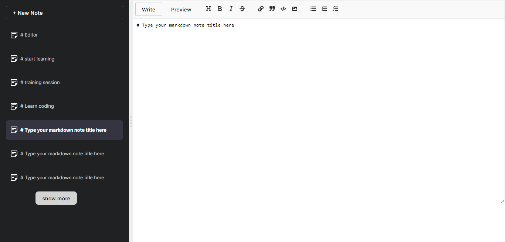

# NOTE APP - Scrimba
This is  the [Note App](). Scrimba challenges help you improve your coding skills by building realistic projects. 

## Table of contents

- [NOTE APP - Scrimba](#note-app---scrimba)
  - [Table of contents](#table-of-contents)
  - [Overview](#overview)
    - [Requirements](#requirements)
    - [The challenge](#the-challenge)
    - [Screenshot](#screenshot)
    - [Links](#links)
  - [My process](#my-process)
    - [Built with](#built-with)
    - [What I learned](#what-i-learned)
    - [Continued development](#continued-development)
    - [Useful resources](#useful-resources)
  - [Author](#author)

## Overview
### Requirements
- create new note
- Add note summary titles
- Sync notes with localStorage
- delete note
- show more notes
- Move modified notes to the top of the list

### The challenge

Users should be able to:

- View the list of notes created.
- create new note 
- show more notes
- Sync notes to localstorage

### Screenshot

### Links

- Solution URL: [Github](https://github.com/alialaba/notes-app)
- Live Site URL: [Netlify](https://note-app-ali.netlify.app/)

## My process

### Built with

- Semantic HTML5 markup
- Reactjs
- CSS custom properties
- Flexbox
- React Components

### What I learned
- Strengthen my knowledge on Reactjs and react hooks.
- Solving  skills with array methods
- creating components

### Continued development
- Reactjs
- React hooks

### Useful resources

- [window localStorage](https://developer.mozilla.org/en-US/docs/Web/API/Window/localStorage) - The localStorage read-only property of the window interface allows you to access a Storage object for the Document's origin; the stored data is saved across browser sessions.
- [React mde](https://www.npmjs.com/package/react-mde) - A simple yet powerful and extensible React Markdown Editor that aims to have feature parity with the Github Markdown editor. React-mde has no 3rd party dependencies.
- [Nano id](https://www.npmjs.com/package/nanoid) - A tiny, secure, URL-friendly, unique string ID generator for JavaScript.

## Author

- Website - [Aliyu AbdulGaniy](https://www.github.com/alialaba)
- Twitter - [@thisaliaba](https://www.twitter.com/thisaliaba)

